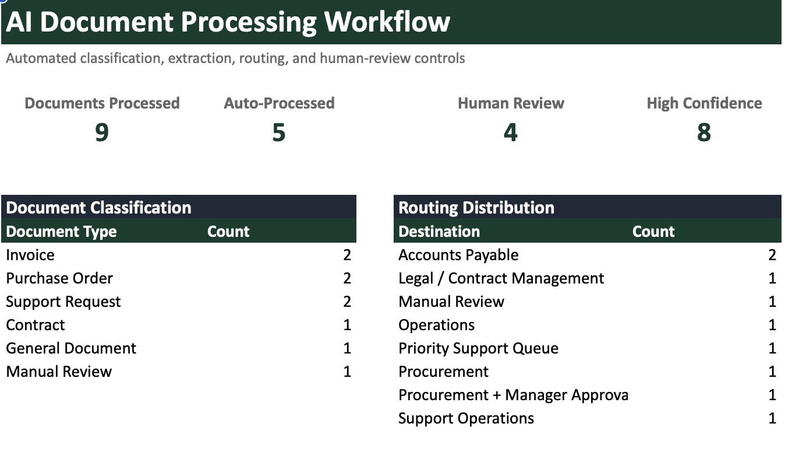

# AI Document Processing Workflow

A production-style document automation workflow that classifies incoming business documents, extracts key information, generates structured summaries, routes documents to the appropriate team, and flags exceptions for human review.

Built as a portfolio project by **Lignum Automation** to demonstrate how repetitive document-processing workflows can be automated with Python and intelligent business rules.



---

## Business Problem

Businesses frequently receive invoices, purchase orders, contracts, support requests, and other documents that must be manually reviewed before being routed to the correct department.

This creates repetitive work and can lead to:

- Slow processing
- Incorrect routing
- Missed high-priority requests
- Inconsistent data extraction
- Limited visibility into document volume
- Manual approval bottlenecks

This project demonstrates an automated workflow for handling that process.

---

## Solution

The workflow automatically processes incoming documents through several stages:

```text
Incoming Documents
        ↓
Text Extraction
        ↓
Document Classification
        ↓
Key-Field Extraction
        ↓
Structured Summary
        ↓
Business Routing Rules
        ↓
Human Review Controls
        ↓
Management Reporting
```

The system intentionally sends uncertain or higher-risk decisions to a human instead of automatically approving everything.

---

## Supported Document Types

The demonstration includes:

- Invoices
- Purchase Orders
- Contracts
- Support Requests
- General Business Documents
- Ambiguous Documents requiring manual review

All sample documents are synthetic and contain no real client or company data.

---

## Example Automation Rules

### Invoice

```text
Document Type: Invoice
Vendor: Northstar Technology LLC
Invoice Number: INV-10482
Amount: $8,450.00
Route: Accounts Payable
Review Required: No
```

### High-Value Purchase Order

```text
Document Type: Purchase Order
Amount: $10,950.00
Route: Procurement + Manager Approval
Review Required: Yes
Reason: Amount requires manager approval
```

### High-Priority Support Request

```text
Document Type: Support Request
Priority: High
Route: Priority Support Queue
Review Required: Yes
```

### Ambiguous Document

```text
Document Type: Manual Review
Confidence: Low
Route: Manual Review
Review Required: Yes
```

---

## Human-in-the-Loop Controls

Not every business decision should be fully automated.

The workflow flags documents for human review when conditions such as these occur:

- Low classification confidence
- Missing required information
- High-value financial transactions
- Contract/legal review requirements
- High-priority support requests
- Documents that cannot be reliably classified

This provides automation while maintaining appropriate business controls.

---

## Output

The pipeline produces:

### Management Report

`Document_Processing_Report.xlsx`

Includes:

- Executive Summary
- Processed Documents
- Human Review Queue
- Routing Summary
- Processing Log

### Processed Dataset

`Processed_Documents.csv`

Contains structured results for every processed document.

### Human Review Queue

`Human_Review_Queue.csv`

Contains only documents requiring additional review or approval.

---

## Example Results

The included demonstration processes **9 synthetic business documents**.

| Metric | Result |
|---|---:|
| Documents Processed | 9 |
| Auto-Processed | 5 |
| Human Review | 4 |
| High-Confidence Classifications | 8 |

The deliberately ambiguous document is correctly routed to manual review rather than being automatically classified.

---

## Project Structure

```text
ai-document-processing-workflow/
│
├── src/
│   ├── main.py
│   ├── extract.py
│   ├── classify.py
│   ├── summarize.py
│   ├── route.py
│   ├── review.py
│   └── generate_sample_documents.py
│
├── sample_documents/
├── output_examples/
├── screenshots/
├── docs/
│
├── requirements.txt
├── README.md
├── .gitignore
└── LICENSE
```

---

## Running the Project

Clone the repository:

```bash
git clone https://github.com/ligma-automation/ai-document-processing-workflow.git
cd ai-document-processing-workflow
```

Create a virtual environment:

```bash
python3 -m venv .venv
source .venv/bin/activate
```

Install dependencies:

```bash
pip install -r requirements.txt
```

Generate the synthetic sample documents:

```bash
python src/generate_sample_documents.py
```

Run the workflow:

```bash
python src/main.py
```

Generated files will appear in:

```text
output_examples/
```

---

## Technology

- Python
- pandas
- XlsxWriter
- Regular expressions
- Rule-based classification
- Automated data extraction
- Business routing logic
- Exception handling
- Human-review controls

---

## Extending the Architecture with AI

The current demonstration uses transparent deterministic classification and extraction rules so the project can run locally without requiring paid API credentials.

The modular architecture can be extended with an LLM or document-intelligence service for capabilities such as:

- Semantic document classification
- Unstructured field extraction
- Natural-language summarization
- Confidence scoring
- More complex document interpretation

This allows deterministic business controls to remain in place while AI handles less structured document understanding.

---

## Use Cases

The same architecture can be adapted for:

- Accounts payable automation
- Contract intake
- Insurance documentation
- Healthcare administration
- Customer support triage
- Procurement workflows
- Compliance review
- Internal operations

---

## About Lignum Automation

**Lignum Automation** builds practical automation systems that reduce repetitive work, improve reporting, connect business systems, and create more reliable operational workflows.

Services include Python automation, data workflows, reporting automation, API integrations, and AI-assisted business processes.